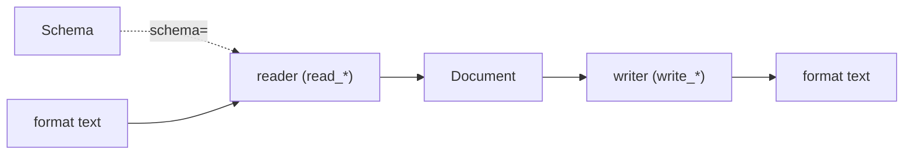

# Schema-directed deserialization

**The guarantee:** if deserialization with `schema=` succeeds, the resulting
Document is guaranteed to conform to the given schema — every leaf matches
its declared scalar, and every field's shape and cardinality are correct. If
the input data doesn't fit the schema, deserialization fails with a
`ParseError` (listing every problem found, not just the first) instead of
returning a partial or non-conforming Document.

Every reader (`read_json` / `read_yaml` / `read_toml` / `read_xml` / `read_oml`,
and the matching `Doc.from_*`) produces a [node](glossary.md) from raw text.
**Without a `schema=`**, every leaf is exactly whatever the format's own
native parser produced — nothing is upgraded. **With `schema=`**, the reader
additionally converts each leaf to match the schema's declared
[`Scalar`](glossary.md) kind, wherever the conversion is **value-exact**.
This page covers that conversion: what changes, what doesn't, and why it's
safe to do without guessing.

Schema awareness is **one-directional, read-only**: a reader optionally
takes `schema=` to upgrade leaves on the way in, but no writer
(`write_json`/`write_yaml`/`write_toml`/`write_xml`/`write_oml`, or the
matching `Doc.to_*` methods) accepts a schema at all — a writer serializes
the Document exactly as it is, never consulting a schema for how to shape
the output.



## The core distinction, demonstrated

The same JSON text, read with and without a schema, can hand back a Document
where the same field holds a *different Python type*. That's the whole
point of the feature:

```python
from omnist import parse_schema, read_json

text = '{"d": "2024-01-01", "n": 3}'

# No schema: leaves are exactly what JSON's own parser produces.
no_schema = read_json(text)
print(no_schema)                  # [('d', '2024-01-01'), ('n', 3)]
print(type(dict(no_schema)["d"]))  # <class 'str'>

# With schema: leaves are additionally upgraded to match the declared Scalar.
s = parse_schema('record R { "d": date, "n": number }\nroot R')
with_schema = read_json(text, schema=s)
print(with_schema)                  # [('d', datetime.date(2024, 1, 1)), ('n', 3.0)]
print(type(dict(with_schema)["d"]))  # <class 'datetime.date'>
```

Without `schema=`, the JSON string `"2024-01-01"` is a plain `str` — JSON has
no `date` type, so its parser can't produce anything else. With `schema=`,
the same string is upgraded to a real `datetime.date` because the schema
says the field `d` is a `date` and the string is a value-exact ISO-8601 date.
Likewise the JSON integer `3` becomes the Python `float` `3.0`, because the
schema says `n` is a `number`.

## What "no schema" already looks like, per format

The JSON "before" picture above — a leaf is just whatever the format's
native parser hands back — is not the same starting point for every format.
Some formats' own parsers already produce native Python temporal types for
some scalars, with no schema involved at all:

| Format | A date leaf with **no** `schema=` |
|---|---|
| JSON | `str` (e.g. `"2024-01-01"`) — JSON has no date type |
| YAML | `datetime.date` already — PyYAML's own loader recognizes unquoted ISO dates |
| TOML | `datetime.date` already — `tomllib`/TOML's grammar has a native date literal |
| XML | `str` (e.g. `"2024-01-01"`) — XML has no date type |
| OML | `str` if written as a quoted string; OML has no separate date literal either, so a `date` leaf only becomes a real `datetime.date` once `schema=` upgrades it |

This means that for YAML and TOML, reading a date field *without* a schema
can already give you a `datetime.date` — passing `schema=` in that case is a
no-op for that field (the value's already value-exact for the declared
scalar). For JSON, XML, and OML, the upgrade from `str` to `datetime.date`
only happens once a schema is supplied. Verified directly:

```python
from omnist import parse_schema, read_json, read_yaml, read_toml, read_xml

s = parse_schema('record D { "d": date }\nroot D')

type(dict(read_json('{"d": "2024-01-01"}'))["d"])                  # str
type(dict(read_json('{"d": "2024-01-01"}', schema=s))["d"])        # datetime.date

type(dict(read_yaml('d: 2024-01-01'))["d"])                        # datetime.date  (already!)
type(dict(read_yaml('d: 2024-01-01', schema=s))["d"])               # datetime.date

type(dict(read_toml('d = 2024-01-01'))["d"])                       # datetime.date  (already!)
type(dict(read_toml('d = 2024-01-01', schema=s))["d"])              # datetime.date

type(dict(read_xml('<d>2024-01-01</d>'))["d"])                     # str
type(dict(read_xml('<d>2024-01-01</d>', schema=s))["d"])            # datetime.date
```

## Why the conversion is unambiguous by construction

A schema's [field](glossary.md) declares exactly one [`Scalar`](glossary.md)
(or one `Ref`) — never a union, never an enum of candidate types. So when
deserialization looks at a raw leaf value and a field's declared scalar,
there's never a choice between *candidate representations* to disambiguate
between — only one question: **does this value exactly fit the one scalar
declared, or not.** That's why the conversion can run automatically with no
configuration and no heuristics.

Passing `schema=` is the request for a **guaranteed-conforming** Document:
deserialization checks shape problems too — a missing or unexpected field,
the wrong cardinality, a record where a scalar is expected — not just
scalar conversions. There's no separate opt-in for this; if you don't want
shape checking (or scalar upgrading), don't pass `schema=` at all, and the
node comes back exactly as the format's own parser produced it. Once you
pass a schema, every problem it finds — scalar *and* shape, all of them, not
just the first — is collected into one raised error.

## When a Document can't be made to conform: `ParseError`

If a leaf's raw value doesn't exactly fit the declared scalar, or the shape
doesn't match (an unknown field, a missing field, the wrong cardinality, a
record where a scalar was expected, or vice versa), deserialization raises
`ParseError` rather than guessing, silently leaving the value unconverted, or
returning a Document that doesn't actually match the schema:

```python
from omnist import parse_schema, read_json, ParseError

s = parse_schema('record R { "n": integer }\nroot R')
read_json('{"n": "abc"}', schema=s)
# ParseError: $.n: 'abc' cannot be read as integer (not a value-exact conversion)

s2 = parse_schema('record R { "a": integer }\nroot R')
read_json('{"a": 1, "b": "extra"}', schema=s2)
# ParseError: $.b: unexpected field
```

`1.5` into `integer` fails the same way (`1.5` has a fractional part, so it's
not a value-exact `int`), while `4.0` into `integer` succeeds (`4.0` is
value-exact as `4`). If more than one problem exists, the `ParseError`
message lists every one of them, each on its own line with its path — the
same multi-error formatting `Schema.validate` uses.

`Schema.validate` still exists and is still useful on its own: it checks an
already-built `Doc` (one made with `doc()`, say) without re-deserializing
anything, and it's the only way to validate a Document you didn't just read
from text. What's changed is that `schema=`/`materialize` no longer needs a
second, separate `validate()` call afterward to catch shape problems — they
share the same checks, run together in one pass.

## Conversion rules

The full, per-kind mapping of what validation accepts (checks a value
already in the document) versus what deserialization additionally converts
(and rejects) for each `Scalar` kind — along with the "`bool` never
satisfies `integer`/`number`," "`number` always deserializes to `float`,"
and "`date`/`datetime` stay mutually exclusive" notes that go with it —
lives in one place: [model spec §10](design/model.md#10-scalar-and-python-type),
the formal definition this page's examples are derived from.

## `materialize`: upgrading an already-parsed node

`schema=` on a reader is sugar for parsing, then calling `materialize`
directly. Use `materialize` when you already have a node — from a reader
called without `schema=`, from `doc()`, or built by hand — and want the same
upgrade applied after the fact:

| | |
|---|---|
| `materialize(node, schema) -> node` | apply the schema-directed upgrade to an already-parsed node |

```python
from omnist import materialize, parse_schema, read_json

s = parse_schema('record R { "d": date }\nroot R')
node = read_json('{"d": "2024-01-01"}')          # no schema yet: 'd' is a str
materialize(node, s)                              # [('d', datetime.date(2024, 1, 1))]
```

See [the API reference](api.md#schema-directed-deserialization) for the bare
function signatures.
