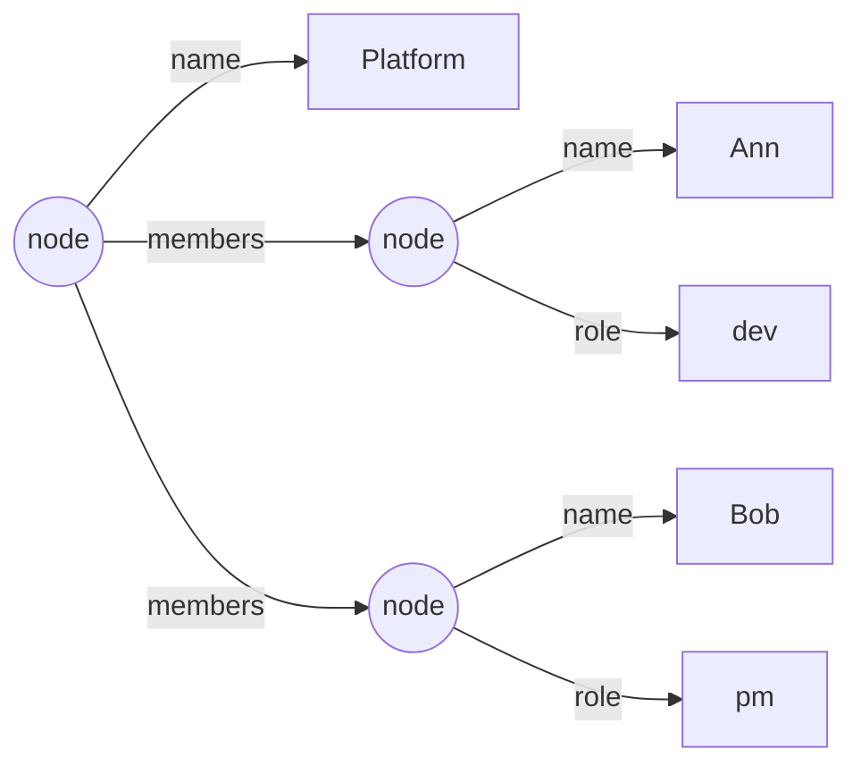

# Document & Schema Model

> The model is **inspired by** Lee & Cheung, *"XML Schema Computations"*
> (CIKM 2010) — but you don't need the paper to read this. The definitions
> below are self-contained and use plain terms (node, edge, label, value,
> field, cardinality, scalar).

## 1. Summary

This defines Omnist's two core models — the **Document** (the data) and the
**Schema** (the constraint) — as one small, format-independent formalism,
deliberately closed, for the JSON family of formats, so the schema operations in §9-§11 stay well-defined.

The headline ideas:

1. A **Document is an ordered list of labeled edges**, not a map whose values may be arrays.
2. A **Schema has exactly three building blocks** — `record` (constrained by its child labels), `Scalar` (one of seven fixed kinds, optionally nullable), and `Ref` (naming and recursion). A field's type is always exactly one `Scalar` or one `Ref` — never a composition of either.
3. **Field cardinality `[min,max]`** is the single mechanism for optional / required / array. There is no separate array type.
4. The model is **closed by construction**: records are closed, scalar types are never composed into enums or unions, and there are no structureless escape hatches (`Any`, open objects, maps). This is what makes `compatible_with`, `equivalent`, `normalize`, and `infer` well-defined, decidable operations -- not a constraint imposed for its own sake.

---

## 2. Why the model looks this way

Three properties shape every other decision in this document:

- **The Document must faithfully represent every supported input.** XML may
  interleave repeated elements (`<member/><other/><member/>`); a map whose
  values are arrays (`{"member": […], "other": …}`) has already reordered
  that and cannot express the interleaving. So the Document is an *ordered
  list of edges*, not a map — it's canonical regardless of format, including
  XML's.
- **"How many times may this label appear, and what shape?" is one idea,
  expressed by one mechanism.** A field's `cardinality [min,max]` covers
  required, optional, and array in a single range, rather than splitting the
  question across several separate mechanisms that would each need their
  own rules (and their own edge cases to get wrong).
- **A schema should guarantee structure, with no escape hatch that lets it
  declare "no structure here."** Every record is closed (§5); there is no
  `Any`, no open/wildcard record, and no open-ended map type (§3).

A field's type is also never a composition of several candidates (no enums,
no unions, no literal values in type position — §5). The reason: if a
field's type could be, say, "either an integer or the literal string
`unlimited`," a value that happens to match more than one candidate (or none
cleanly) leaves no principled way to pick which Python type to materialize
it as when deserializing (§10). A field's type is always exactly one fixed
scalar kind (optionally nullable) or one `Ref` to a record, so there's never
a choice to make.

---

## 3. Goals and non-goals

**Goals**
- One canonical Document model, format-independent, faithful to every supported input (including XML interleaving).
- A small, self-contained schema model that's closed by construction -- every operation over it (`validate`, `compatible_with`, `equivalent`, `normalize`, `infer`) has exactly one answer, never a best-effort guess.
- A clean formal definition both models can be specified and reasoned about from.

**Non-goals (deliberately out of scope for now)**
- **Maps / open key sets** (`{ [string]: T }`) — not expressible; reintroduce later as an explicit, opt-in construct if needed.
- **Wildcard / open records** and **`Any`** — not expressible; they would abandon structure.
- **Structural unions** (`{a}|{b}`), **value-domain unions/enums** (`"a" | "b"`), and **positional tuples** (`[string, integer]`) — not expressible (see §2 for why, on the value-domain side).
- **Constrained scalars** (e.g. `Email = string matching …`) — no value refinements yet.
- **Order-sensitive fields** — validation is order-free (see §4, §7).

---

## 4. Document model

A Document is a **node**: either a scalar value, or an ordered list of labeled edges.

```
value   = scalar  (string · integer · number · boolean · date · time · datetime)  |  null
edge    = (label: String, target)            where target = value | node
node    = [ edge, edge, … ]                  -- ordered; labels MAY repeat
Document = node                              -- (or a bare value at a leaf)
```

**Properties**

- **"Many" is a repeated label.** An array of `Member`s is the label `member` occurring N times — not a field pointing to an array. JSON `{"member":[A,B]}` and XML `<member>A</member><x/><member>B</member>` both become `[(member,A), …, (member,B)]`.
- **Object and array unify.** A node is just an ordered edge list; the object-vs-array distinction vanishes.
- **Order is preserved in the Document** (it is the canonical, faithful record) but is **data, never a schema constraint** (§7). A reordered round-trip remains schema-valid.

**Format mapping.** See [Formats](../formats/overview.md#how-a-format-becomes-a-document)
for the full table of how each supported format's constructs map onto this
Document shape.

This is the model-level shape; for the full formal grammar of OML — the
concrete syntax that maps onto it — see [the OML-Core grammar](oml-grammar.md).

---

## 5. Schema model

A **Schema** is `(root, env)`, where `root` is a `Ref` and `env` maps names to **record definitions**. There is exactly one definition kind: a **record**, which constrains a node by its child labels. A field's type is either a `Scalar` (one of seven fixed kinds, optionally nullable) or a `Ref` to a named record — never a composition of several candidates.

```
Schema      = root: Ref ;  env: Name ⇀ Record

Record  = { Field… }                         -- CLOSED: only these labels
Field   = (label: String, type: Type, cardinality: [min, max])
Type    = Scalar | Ref(Name)                 -- exactly one scalar kind, or a named record

Scalar  = (kind, nullable: bool)             -- kind ∈ { string, integer, number, boolean, date, time, datetime }
          -- exactly one of the seven fixed kinds; never composed with another kind or a literal value
```

**Rules**

- **Records are closed.** Any label not named by a field is invalid. (No wildcard.)
- **Cardinality is the *only* mechanism for multiplicity** — how many times a label may appear, order ignored: `[1,1]` required (default), `[0,1]` optional, `[0,∞]` array, `[1,∞]` non-empty array, `[2,5]` bounded. **There is no separate Array type** — array-of-record is `cardinality > 1` with a `Ref` item.
- **`?` applies to scalars only.** `string?` is a nullable `Scalar{string}`. It **cannot** apply to a `Ref`. "This record may be absent" is `cardinality [0,1]`, never `?` (see §6).
- **Records are always named and reached by `Ref`.** No inline/anonymous records — this makes the schema a graph of named definitions (so reuse and recursion are uniform), not a nested tree.
- **A `Scalar` is exactly one fixed kind, optionally nullable — never composed.** No enums, no literal values in type position, no combining two kinds.

**Surface syntax** (shorthands desugar to the model)

```
record Member {
    "name": string,                  -- Scalar{string}
    "role": string,
}
record Team {
    "name":         string,
    "members" [0,]: Member,          -- cardinality [0,∞]; Ref(Member)
    "lead" [0,1]:   Member,          -- optional
}
root Team
```

- **Quoting rule:** `"quoted"` = a **data string** (a field label); an **unquoted identifier** = a **schema name** (a scalar kind or a `Ref`).
- `string?`, `integer?`, etc. are the nullable form of a scalar — the only suffix the grammar allows.
- `record` is the one naming keyword. ("type" is *not* a keyword — it would be ambiguous between "a definition", "the thing being named", and a record.)

This is the model-level shape; for the full formal grammar of the Schema
DSL concrete syntax shown above, see
[the Schema DSL grammar](schema-dsl-grammar.md).

---

## 6. Two deliberate exclusions

Two things the model intentionally cannot express, and why:

- **A record-or-null field.** A field's type is *either* a scalar *or* a `Ref` to a record — never both at once. "This value is a string or null" is a nullable scalar (`string?`); "this subtree is a Manager record or a bare null" would need a type that is half scalar and half `Ref`, which the model doesn't allow. So `?` (which makes a *scalar* nullable) applies only to scalars, and "this record might not be here" is expressed by **cardinality `[0,1]`** (the field may be absent) — not by a nullable reference.
- **Maps / open key sets.** A record names every label it allows. An open-ended key set ("any string key, all of type T") would be a structureless hole, so it's deferred (§3). Use a named record when the keys are known; for genuinely open data, this is a future, opt-in feature.

---

## 7. Conformance (validation)

A node `n` conforms to a `Record R` iff:
1. **Cardinality** — for each field `(label, type, [m,k])`, the count of edges in `n` with that label is in `[m,k]`.
2. **Closedness** — every edge label in `n` is some field of `R`.
3. **Targets** — each matching edge's target conforms to that field's `type`.

A value conforms to a `Scalar` iff it matches the scalar's kind (or is `null` and the scalar is nullable). A target conforms to `Ref(N)` iff it conforms to `env[N]`. "Matches the scalar's kind" is defined precisely in §10 — validation only *checks* a match (it never converts a value); §10 also covers *deserialization*, which additionally converts a matching value to a canonical Python type.

**Order is ignored.** Cardinality counts edges; it never constrains their sequence. A JSON document and an interleaved XML document with the same edges (in any order) conform identically.

---

## 8. Serialization (Document → format)

Group all edges sharing a label into one key, regardless of position: `[(m,A),(x,X),(m,B)]` → `{"m":[A,B], "x":X}`. Within-label order (`A` before `B`) is preserved; cross-label interleaving is dropped (no JSON-family format can express it). See §9 (1) for the count-1 rule.

---

## 9. Resolved decisions

The corner cases, and how they're settled:

1. **Count-1 serialization → always-list, by design — writers never take a
   schema.** A single-element array can't be told apart from a single value
   from the Document alone (both are one edge), so a label seen exactly once
   always serializes as a bare value, and a label seen more than once always
   serializes as a list. None of the writers (`write_json`/`write_yaml`/
   `write_toml`/`write_xml`, or the matching `Doc.to_*` methods) accept a
   `schema=` parameter, and none will: a writer's job is to serialize the
   Document exactly as it is, not to consult a schema for how to shape the
   output. Schema awareness is one-directional, on the **read** side only —
   see [schema-directed deserialization](../deserialization.md), where
   `schema=` upgrades leaves (and *only* leaves) to match declared types.
   There is no plan to add a write-side equivalent.
2. **Array-of-scalar → a repeated label**, uniform with array-of-record (`"tags"[0,]: string`). One mechanism (cardinality) for all "many," matching XML's repeated elements.
3. **Bare nested arrays (`[[1,2],[3,4]]`) → forbidden for now.** Inner elements have no label, so there's no edge to give them (and XML can't express them either); reading one raises a clear error. Revisit only if a concrete need appears.
4. **Root → a `Ref` to a single record (single-rooted).** Guarantees a lossless XML round-trip (one document element) and keeps the entry point uniform with every other definition.

---

## 10. Scalar and Python type

A `Scalar`'s kind determines which Python type a conforming value is held as.
**Validation and deserialization use this mapping differently**, and the
difference is deliberate:

- **Validation** (`Schema.validate`) only *checks* whether a value already in
  the document — in whatever Python type it happens to be — matches a
  scalar's kind. It never converts anything.
- **Deserialization** (`materialize`, or `schema=` on a reader) additionally
  *converts* a matching value to the canonical Python type below, succeeding
  only when the conversion is **value-exact**, and raising `ParseError`
  otherwise. This is unambiguous by construction: a field has exactly one
  candidate scalar (§5), so there is never a choice between candidate
  representations — only "does this value exactly fit the one scalar
  declared, or not."

| Scalar kind | Canonical Python type | What validation accepts | What deserialization additionally converts | What deserialization rejects |
|---|---|---|---|---|
| `string` | `str` | any `str` | nothing (no other type converts to `str`) | every non-`str` value |
| `integer` | `int` | any `int` that isn't a `bool` | a `float` with no fractional part (`x.is_integer()`), e.g. `4.0 → 4` | `bool` (even though `bool` is an `int` subclass in Python); a `float` with a fractional part (`4.5`); any `str` |
| `number` | `float` | an `int` or a `float`, neither a `bool` | an `int` is **always** upgraded to `float` (`3 → 3.0`) — see note below | `bool`; any `str` |
| `boolean` | `bool` | any `bool` | nothing (no string `"true"`/`"false"` parsing) | every non-`bool` value |
| `date` | `datetime.date` | a real `date` that is **not** a `datetime` (see note below); or an ISO-8601 date string (`"2024-01-01"`) | the ISO-8601 date string, to a real `date` | a real `datetime` value (even though `datetime` is a `date` subclass); a string that isn't a valid bare ISO date |
| `time` | `datetime.time` | a real `time`; or an ISO-8601 time string (`"12:00:00"`) | the ISO-8601 time string, to a real `time` | a string that isn't a valid ISO time |
| `datetime` | `datetime.datetime` | a real `datetime`; or a full ISO-8601 timestamp string that is **not** also a bare date string | the timestamp string, to a real `datetime` | a bare ISO date string (`"2024-01-01"` alone never satisfies `datetime`, only `date`); a string that isn't a valid full timestamp |

Notes:

- **`bool` never satisfies `integer` or `number`.** Python's `bool` is an
  `int` subclass, so `isinstance(True, int)` is `True` — but a schema's
  `integer`/`number` scalar explicitly excludes it. `true`/`false` only ever
  satisfy `boolean`.
- **`number` always deserializes to `float`, even from an integer literal.**
  A JSON/YAML/TOML value `3` read against a `"v": number` field materializes
  as the Python `float` `3.0`, not the `int` `3` — `number` means "the
  `float` representation," and `integer` (`int`) is the one scalar kind that
  is a subset of it (the same subset relation `compatible_with`/`normalize`
  and `infer`, §11 step 2, use).
- **`datetime` is a subclass of `date` in Python**, and
  `datetime.fromisoformat` will happily parse a bare date string into a
  `datetime` at midnight — both are explicitly excluded so `date` and
  `datetime` stay mutually exclusive for *both* the real-object form and the
  string form. A bare date string only ever satisfies `date`; a real
  `datetime.datetime(2024, 1, 1)` (even at midnight) only ever satisfies
  `datetime`, never `date`.
- **Shape mismatches are validation's job, not deserialization's.** If a
  value's *structure* doesn't match what's expected at all (a record where a
  scalar is expected, or vice versa) or a field is missing/unexpected,
  `materialize` passes the node through unchanged for `Schema.validate` to
  flag — it only ever converts a value it can identify as belonging to a
  known field's scalar.

## 11. Inference: determining a field's `Scalar` from samples

`infer(samples)` drafts a `Scalar` for each scalar-valued field as follows,
given the values observed across all samples for that field's label:

1. **Collect the kind of every non-`null` value**, using the same kind names
   as §10's table (a Python `bool` → `boolean`, an `int` → `integer`, a
   `float` → `number`, a `datetime.datetime` → `datetime`, a `datetime.date`
   → `date`, a `datetime.time` → `time`, anything else → `string`).
2. **Collapse `integer` into `number`** if both were observed — the one
   subset relation between scalars (every integer value is also a number).
   No other pair collapses.
3. **If more than one kind remains after the collapse, raise `SchemaError`.**
   A field can be inferred to exactly one scalar or not at all; e.g. samples
   with `1` and `"x"` for the same label raise, but `1` and `2.5` infer
   `number`.
4. **The field is `nullable` iff any sample's value was `null`.** This is
   fully orthogonal to step 1–3: a label with values `1`, `null` infers
   `integer?`, never raising on account of the `null`.
5. **If every observed value was `null`** (the label occurred in at least
   one sample, but never with a non-`null` value), there is no kind
   information to infer from. `infer` defaults to `Scalar("string",
   nullable=True)`. (A label that never occurs in *any* sample — including
   one that's always an empty array — gets no field at all; that's a
   property of the cardinality bookkeeping in §9(2), not of this algorithm,
   since this algorithm only ever runs for a label that occurred at least
   once.)

---

## Appendix: worked example

Schema:

```
record Member {
    "name": string,
    "role": string,
}
record Team {
    "name":         string,
    "members" [0,]: Member,
}
root Team
```

Document (canonical edge list) for a two-member team:

```
[ ("name", "Platform"),
  ("members", [ ("name","Ann"), ("role","dev") ]),
  ("members", [ ("name","Bob"), ("role","pm")  ]) ]
```

- JSON projection: `{"name":"Platform", "members":[{"name":"Ann","role":"dev"},{"name":"Bob","role":"pm"}]}`
- XML projection: `<name>…</name><members>…Ann…</members><members>…Bob…</members>` (and an interleaved XML input round-trips through the *same* Document).
- Conformance: `members` occurs twice ∈ `[0,∞]` ✓; each `members` target conforms to `Member` ✓; `name` once ∈ `[1,1]` ✓; no unlisted labels ✓.

The same Document as a tree of labeled edges. The two `members` edges share
one label — that repetition *is* the array; there is no separate list node:


