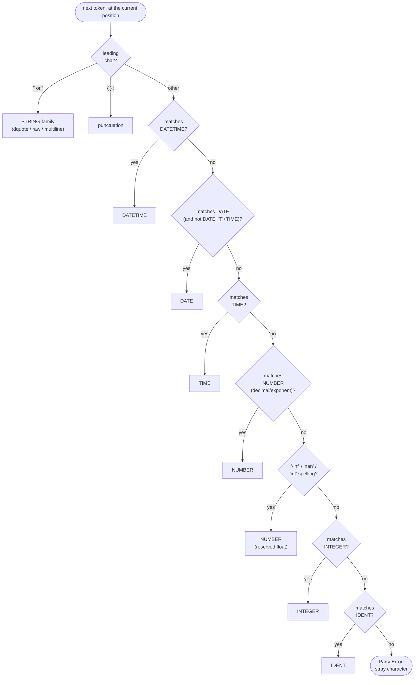

# OML-Core formal grammar

This is the formal grammar for **OML-Core** — the subset of OML the
canonical writer emits and every conformant reader must accept — written in
ABNF ([RFC 5234](https://www.rfc-editor.org/rfc/rfc5234)). It is the
normative companion to the user-facing tour in [the OML format
page](../formats/oml.md); read that first for context and examples, and the
[glossary](../glossary.md) for the terms used here (node, edge, label,
scalar value).

It also documents the **OML-Extended** read-only spellings the tokenizer
accepts — the raw string (`'...'`) and triple-quoted multiline string
(`"""..."""`) forms — which the canonical writer never produces but
`read_oml` understands on input.

Every production below has been exercised against the real implementation
in [`omnist/canonical/oml.py`](https://github.com/omnist-dev/omnist/blob/master/omnist/canonical/oml.py) (the `_Scanner`
tokenizer and `_Parser` parser); see [Worked examples](#7-worked-examples) and
the conformance tests in
[`tests/test_grammar_docs.py`](https://github.com/omnist-dev/omnist/blob/master/tests/test_grammar_docs.py).

## 1. Lexical grammar (tokens)

The tokenizer (`_Scanner`) scans **maximal munch with a fixed priority
order** at every position: it tries STRING-family and punctuation first
(each pinned to its own leading character, so these never compete with
anything else), then DATETIME, DATE, TIME, NUMBER, the three reserved float
spellings (`nan`, `inf`, `-inf`), INTEGER, then `IDENT`. The first matching
rule wins and consumes the *longest* match for its own pattern — there is no
later backtracking between rules. See `_Scanner._next` for the literal order
this grammar mirrors:



This is exactly why `nan: 1` and `inf: 1` are `ParseError`s (Worked example
#9 below) — `nan`/`inf`/`-inf` are claimed by the reserved-float branch
*before* `IDENT` is ever tried, so they can never become a bare label; only
the quoted spelling (`"nan"`, `"inf"`) reaches the `STRING` branch instead.

```abnf
; -- whitespace, comments, separators -----------------------------------

hspace      = %x20 / %x09                  ; space, tab (intra-line only)
comment     = "#" *(%x00-09 / %x0B-10FFFF) ; '#' to end of line, NL excluded
newline     = %x0D.0A / %x0A               ; CRLF or LF
SEP         = 1*( hspace / comment / newline / ";" )
              ; one or more of these collapse into a single SEP token, as
              ; long as at least one newline/";" occurs; pure hspace/comment
              ; with no newline or ";" is just skipped (no token emitted)

; -- punctuation ----------------------------------------------------------

LBRACE      = "{"
RBRACE      = "}"
COLON       = ":"

; -- identifiers and reserved words --------------------------------------

IDENT       = (ALPHA / "_") *(ALPHA / DIGIT / "_" / "-")
ALPHA       = %x41-5A / %x61-7A            ; A-Z / a-z
DIGIT       = %x30-39                      ; 0-9

reserved-word   = %s"null" / %s"true" / %s"false"
reserved-number = %s"nan" / %s"inf" / "-" %s"inf"
              ; "nan"/"inf"/"-inf" are matched as NUMBER, never IDENT, by
              ; priority order (§1 above) -- they are not in the IDENT
              ; grammar's reserved set, they are pre-empted before IDENT is
              ; even tried. reserved-word ("null"/"true"/"false") *is*
              ; IDENT-shaped; it is excluded only at the *parser* level
              ; (a bare label can't be one of these three words -- see §4).

; -- numeric and temporal literals ---------------------------------------

INTEGER     = ["-"] 1*DIGIT
              ; digit count (sign excluded) is capped at 4300 -- see §6.

NUMBER      = decimal-num / exponent-num / reserved-number
decimal-num = ["-"] 1*DIGIT "." 1*DIGIT [exponent]
exponent-num = ["-"] 1*DIGIT exponent
exponent    = ("e" / "E") ["+" / "-"] 1*DIGIT

DATE        = 4DIGIT "-" 2DIGIT "-" 2DIGIT
              ; matched only when NOT immediately followed by "T" + a
              ; TIME-shaped lookahead -- see §1.1.

TIME        = 2DIGIT ":" 2DIGIT [":" 2DIGIT ["." 1*6DIGIT]] [tz-offset]
tz-offset   = ("+" / "-") 2DIGIT ":" 2DIGIT

DATETIME    = DATE "T" 2DIGIT ":" 2DIGIT
              [":" 2DIGIT ["." 1*6DIGIT]] [tz-offset]

; -- strings ---------------------------------------------------------------

STRING      = dquote-string / raw-string / multiline-string

dquote-string  = DQUOTE *( unescaped / escape ) DQUOTE
DQUOTE      = %x22                          ; '"'
unescaped   = %x20-21 / %x23-5B / %x5D-10FFFF
              ; any character >= U+0020 except '"' (x22) and '\' (x5C);
              ; control characters (< U+0020) are rejected with a ParseError
escape      = "\" ( %x22 / "\" / "/" / "b" / "f" / "n" / "r" / "t"
                   / "u" 4HEXDIG [ "\" "u" 4HEXDIG ] )
              ; \", \\, \/, \b, \f, \n, \r, \t, or \uXXXX -- a \uXXXX in the
              ; high-surrogate range (D800-DBFF) MUST be immediately
              ; followed by a second \uXXXX low-surrogate (DC00-DFFF);
              ; an unpaired high or low surrogate escape is a ParseError.
HEXDIG      = DIGIT / %x41-46 / %x61-66     ; 0-9 / A-F / a-f

; -- OML-Extended (read-only; the writer never emits these) ---------------

raw-string  = "'" *(%x00-26 / %x28-10FFFF) "'"
              ; everything between single quotes is literal -- no escape
              ; processing at all, including backslash and newline.

multiline-string = DQUOTE DQUOTE DQUOTE [newline]
                    *( ( DQUOTE DQUOTE not-3-dquote ) / mlchar )
                    DQUOTE DQUOTE DQUOTE
              ; opens with """, optionally followed immediately by one
              ; newline (consumed, not part of the value); closes at the
              ; *first* run of 3 or more '"' characters encountered -- only
              ; the first 3 quotes of that run are consumed as the
              ; terminator (see §1.2); a run of exactly 1-2 quotes is
              ; literal content, not a terminator.
mlchar      = %x09 / %x0A / %x20-10FFFF     ; tab, LF, or >= U+0020
              ; (control chars other than tab/LF are rejected)
```

### 1.1 DATE vs. DATETIME disambiguation

At a position where `DATE` matches, the scanner does **not** emit a `DATE`
token if the character immediately after the date digits is `T` *and* the
text following that `T` itself matches `TIME`. In that case it instead
tries `DATETIME` (which, since `DATETIME = DATE "T" TIME-body`, will
succeed). If the text after `T` does **not** look like a time (e.g.
`2024-01-01T99`, where `99` does not match `TIME`'s `2DIGIT ":" 2DIGIT...`
shape), the scanner emits a plain `DATE` token for the date part, and the
`T99` that follows becomes a separate `IDENT` token (`T` is alphabetic, so
`T99` matches the `IDENT` pattern) — this is exactly maximal-munch-per-rule,
not a single combined lookahead across the whole token stream. See
[Worked examples](#7-worked-examples) #1-#2.

### 1.2 Multiline string termination (OML-Extended)

A `"""..."""` string closes at the **first** point where three or more
consecutive `"` characters appear. Only the first three of that run are
consumed as the closing delimiter; any further `"` characters in the run
are left in the source and re-tokenized by the main scanner immediately
after (so e.g. a run of 5 quotes closes the string with the first 3, and
leaves a 2-quote run — which is *not* by itself a valid `STRING` start, and
is a ParseError at the parser level, since two bare `"` would attempt to
open an empty-then-unterminated string). See [Worked examples](#7-worked-examples)
#7-#8.

### 1.3 Reserved spellings are tokenizer-level, not parser-level, for numbers

`nan`, `inf`, and `-inf` are recognized as `NUMBER` tokens by the scanner
itself (priority order in §1), so they can never be mistaken for an
`IDENT` — `nan: 1` always means the label `nan` is rejected as *not a
label* (it's a NUMBER token, and `_looks_like_edge` only treats `STRING`
and non-reserved `IDENT` followed by `COLON` as edges), forcing a quoted
spelling `"nan": 1` if a literal label `nan` is wanted. By contrast `null`,
`true`, `false` are tokenized as ordinary `IDENT` tokens and excluded only
by the *parser* (§4) — a meaningful difference if you're hand-rolling a
tokenizer-only consumer. See [Worked examples](#7-worked-examples) #9-#10.

## 2. Syntactic grammar (document, edges, values)

```abnf
document    = [SEP] ( value / node-edges ) [SEP]
              ; a document is exactly one node: either a single scalar
              ; value, or a (possibly empty) list of top-level edges.
              ; Leading/trailing SEP is allowed; anything else left over
              ; after the one node is a ParseError ("unexpected trailing
              ; content").

node-edges  = edge *( SEP edge ) / ""
              ; zero or more `label: value` edges, SEP-separated; the same
              ; label may repeat (an edge list, not a map) and edges may
              ; interleave freely -- there is no uniqueness or ordering
              ; constraint on labels.

edge        = label COLON value

label       = STRING / bare-label
bare-label  = IDENT                ; rejected at parse time if IDENT's text
                                    ; is "null", "true", or "false" (§4)

value       = scalar / "{" [SEP] node-edges [SEP] "}"
              ; "{}" (with only SEP, if any, between the braces) is a valid
              ; value: the empty edge list.

scalar      = STRING / INTEGER / NUMBER / DATE / TIME / DATETIME
            / %s"null" / %s"true" / %s"false"
              ; a bare IDENT that is none of null/true/false is a
              ; ParseError ("bare word ... is not a valid value here;
              ; strings must be quoted") -- there is no implicit
              ; string-from-identifier coercion anywhere in OML.
```

Nesting depth — the number of `{` braces a value may be wrapped in — is
capped at 200 (`_MAX_DEPTH`); see §6.

### 2.1 Top-level node-kind disambiguation

`document`'s grammar is ambiguous on paper (a bare `IDENT`/`STRING` could
start either a `scalar` or an `edge`), but the parser resolves it with one
token of lookahead before committing (`_looks_like_edge`): if the current
token is a `STRING` or a non-reserved `IDENT` **and** the token immediately
after it is `COLON`, the document is parsed as `node-edges`; otherwise it is
parsed as a single `scalar`. This lookahead only fires at the very start of
the document (and recursively, at the start of each value inside `{ }`) —
it is not a general operator-precedence ambiguity.

One sharp edge from this: `null: 1` at the top level is **not** the
"reserved word as label" error from §4 — `null` fails the `_looks_like_edge`
check (reserved words are excluded from the edge lookahead), so the parser
takes the `scalar` branch, consumes `null` as the value `None`, and then
fails afterward on the unconsumed `:` as ordinary trailing content. The same
`null: 1` written *inside* a node (e.g. `a: { null: 1 }`) does hit the
explicit reserved-word check in `parse_label`, with a different, more
specific error message. See [Worked examples](#7-worked-examples) #11-#12.

## 3. String escaping rules

Inside a `dquote-string` or `multiline-string`, the recognized escapes are
exactly: `\"`, `\\`, `\/`, `\b`, `\f`, `\n`, `\r`, `\t`, and `\uXXXX` (4 hex
digits). A `\uXXXX` in the UTF-16 high-surrogate range `D800`-`DBFF` must be
immediately followed by a second `\uXXXX` escape in the low-surrogate range
`DC00`-`DFFF`; the pair is combined into one astral code point. Any other
backslash escape, or an unpaired surrogate escape, is a `ParseError`. Any
literal control character (code point < `U+0020`, except tab/LF inside a
multiline string) is rejected unescaped.

A `raw-string` (`'...'`, OML-Extended, read-only) performs **no** escape
processing at all — a backslash inside single quotes is a literal
backslash, and there is no way to include a `'` character in a raw string
(the first `'` always closes it).

The canonical writer ([`_write_string`](https://github.com/omnist-dev/omnist/blob/master/omnist/canonical/oml.py))
only ever emits `\"`, `\\`, `\n`, `\r`, `\t`, and `\u00XX` (for other
control characters) — it never emits `\/`, `\b`, `\f`, surrogate pairs (it
emits literal non-ASCII characters unescaped), raw strings, or multiline
strings; those are read-only conveniences.

## 4. Labels: bare vs. quoted, and reserved words

A `bare-label` is an `IDENT` whose text is **not** `null`, `true`, or
`false` — using one of those three words unquoted as a label inside `{ }`
is a `ParseError` with a message naming the specific reserved word and
suggesting the quoted spelling. Any other `IDENT`-shaped text, and any
`STRING`, is a valid label. The canonical writer
([`_write_label`](https://github.com/omnist-dev/omnist/blob/master/omnist/canonical/oml.py)) emits a bare label only
when the label text matches the `IDENT` shape *and* is not one of `null`,
`true`, `false`, `nan`, `inf`; otherwise it quotes the label.

## 5. Top-level document shapes

Unlike most formats, an OML document is not required to have a single root
object — `document` (§2) accepts:

- a single top-level **scalar** (`"hello"`, `42`, `null`, ...) — the
  document *is* that one leaf value, with no wrapping edge;
- zero or more top-level **edges**, of which there can be more than one
  (including repeats of the same label) — there is no implicit top-level
  object/array wrapper.

A document containing more than one top-level item that doesn't parse as a
single edge list (e.g. two bare scalars back to back) is a `ParseError`.

## 6. Documented limits

| Limit | Value | Constant | Enforced where |
|---|---|---|---|
| Integer literal digit count (sign excluded) | 4300 | `_MAX_INT_DIGITS` in `omnist/canonical/oml.py` | `_Scanner._emit_integer`, at tokenize time |
| Nesting depth (`{` levels) | 200 | `_MAX_DEPTH` in `omnist/canonical/oml.py` | `_Parser.parse_value`, at parse time |

The integer-digit limit matches CPython's own default
`sys.get_int_max_str_digits()` — int-to-str/str-to-int conversion on
arbitrarily large digit strings is superlinear, so this is a
denial-of-service guard, not a data-modeling constraint. The nesting-depth
limit matches the Document model's own bound (`document.py`). Both raise
`ParseError` rather than letting a pathological input hang or exhaust
memory/stack. Verified exactly at the boundary: a 4300-digit integer and
200 levels of `{` both parse; a 4301-digit integer and 201 levels both raise
`ParseError` (see [Worked examples](#7-worked-examples) #13-#14, and
`tests/test_grammar_docs.py`).

## 7. Worked examples

Each row was run against `read_oml`/`write_oml` to confirm the claimed
behavior (see `tests/test_grammar_docs.py` for the executable form).

| # | Input | Result |
|---|---|---|
| 1 | `2024-01-01T10:30` | `DATETIME` token → `datetime.datetime(2024, 1, 1, 10, 30)` |
| 2 | `2024-01-01T99` | `DATE` token (`2024-01-01`) followed by `IDENT` token (`T99`) → trailing-content `ParseError` |
| 3 | `a: 'C:\no\escapes'` | raw string, value is the literal text `C:\no\escapes` (backslashes not processed) |
| 4 | `a: """␊hello␊world"""` | multiline string, value `"hello\nworld"` (leading newline after `"""` is stripped) |
| 5 | `a: """␊says ""hi"" there"""` | embedded 2-quote runs are literal; value `'says ""hi"" there'` |
| 6 | `null: 1` (inside `{ }`) | `ParseError`: `'null' is a reserved word and cannot be a bare label; quote it: "null"` |
| 7 | `a: """␊x""""` (4 trailing quotes) | first 3 quotes close the string; the 4th quote starts an unterminated `dquote-string` → `ParseError` |
| 8 | `a: """␊x"""""` (5 trailing quotes) | first 3 close the string; remaining 2 quotes are a 2-character leftover, rejected as an unexpected token after the value |
| 9 | `nan: 1` | `ParseError` (`nan` is tokenized as `NUMBER`, never reaches the edge/label grammar at all) |
| 10 | `"nan": 1` | OK — quoting forces the `STRING` token, which *is* a valid label |
| 11 | `null: 1` (top level) | OK as far as `null` (parsed as the scalar `None`), then `ParseError` on the leftover `:` as trailing content — a different failure mode than #6 |
| 12 | `a: { null: 1 }` | the explicit reserved-word `ParseError` from #6 (label position is unambiguous inside `{ }`) |
| 13 | integer with 4300 digits / 200 levels of `{` nesting | both parse successfully |
| 14 | integer with 4301 digits / 201 levels of `{` nesting | both raise `ParseError` naming the limit |
| 15 | `tag: "x"␊tag: "y"` | repeated label → two edges, `[('tag', 'x'), ('tag', 'y')]` (an array is just a repeated label, never a list value) |
| 16 | `a: {}` | empty node value → `[('a', [])]` |
| 17 | `"hello"` (top level, no label) | the whole document is the single scalar `'hello'` |
| 18 | `write_oml([('a', 1), ('b', [('x', 1), ('y', 2)])], indent=None)` | compact form `'a: 1; b: { x: 1; y: 2 }'`, which `read_oml` parses back to the same node |
