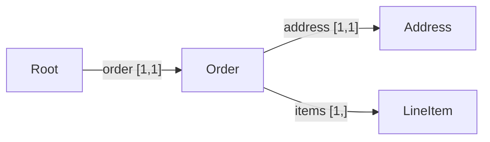
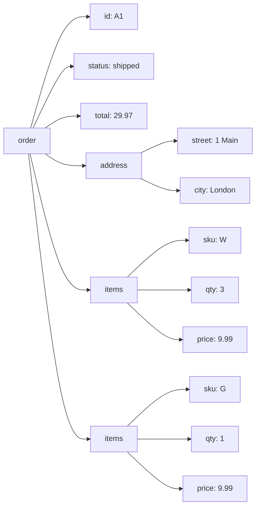

# A real-life example

One schema, one Document, validated against an order written in **OML**
(Omnist's own format — see [the guide](guide.md#oml--the-native-format)),
plus the schema operations used the way you would in practice. The same
Document also reads in from JSON, YAML, TOML, and XML — see
[Translating to other formats](#translating-to-other-formats). Every snippet
here is verified against the library.

## The schema

An order: an id, a status, a total, a shipping address, one or more line
items, and an optional coupon. The whole thing sits under a single top-level
`order` key — that makes it *single-rooted*, so the **same** Document comes back
from JSON, YAML, TOML, **and** XML (XML always has one document element; see
[the XML notes](formats/xml.md)).

```
record Address  { "street": string, "city": string }
record LineItem { "sku": string, "qty": integer, "price": number }

record Order {
    "id":      string,
    "status":  string,
    "total":   number,
    "address": Address,
    "items" [1,]: LineItem,        # at least one line item
    "coupon" [0,1]: string,         # optional
}

record Root { "order": Order }      # single top-level key
root Root
```

The records of this schema form a graph, linked by `Ref` edges with the
field's cardinality attached:



The same schema with the Python builder:

```python
from omnist import schema, record, field, ref, t

address  = record(field("street", t.string), field("city", t.string))
lineitem = record(field("sku", t.string), field("qty", t.integer),
                  field("price", t.number))
order = record(
    field("id",      t.string),
    field("status",  t.string),
    field("total",   t.number),
    field("address", ref("Address")),
    field("items",   ref("LineItem"), min=1, max=None),   # [1,]
    field("coupon",  t.string, min=0, max=1),              # optional
)
s = schema(ref("Root"),
           Root=record(field("order", ref("Order"))),
           Order=order, Address=address, LineItem=lineitem)
```

## The order, in OML

```python
from omnist import parse_schema, read_oml, Doc

s = parse_schema(SCHEMA)   # the DSL above

o = read_oml('''
order: {
    id: "A1"
    status: "shipped"
    total: 29.97
    address: { street: "1 Main"; city: "London" }
    items: { sku: "W"; qty: 3; price: 9.99 }
    items: { sku: "G"; qty: 1; price: 9.99 }
}
''')

s.validate(Doc(o)).ok      # True
```

The resulting Document, as a tree of labeled edges (the two `items` edges
share the label `items` — that's how an array of records is written;
there's no list syntax, just the label repeating, in order):



Notice the two `items` edges share the label `items` — that's how an array
of records is written; there's no list syntax, just the label repeating, in
order.

## A rejected order

Validation reports every problem, at its exact path:

```python
bad = Doc.from_oml('''
order: {
    id: "A2"
    status: "shipped"
    total: "ten"
    address: { street: "x"; city: "y" }
}
''')
print(s.validate(bad))
# invalid:
#   at $.order.total: expected number, got string ('ten')
#   at $.order: field 'items' occurs 0 time(s), expected at least 1
```

## Translating to other formats

The Document above didn't have to come from OML — JSON, YAML, TOML, and XML
all read into the *identical* Document too, and `Doc` writes back out to any
of them. OML is just the one shown here because it's the only format that
needs no caveats (see [Formats](formats/overview.md) for what each of the
other four gives up).

```python
Doc(o).to_json()
# '{"order": {"id": "A1", "status": "shipped", "total": 29.97, ...}}'
```

And the reverse — the same order, read from each of the other formats,
produces the identical Document `o` above:

```python
from omnist import read_json, read_yaml, read_toml, read_xml

j = read_json('''
{"order": {"id": "A1", "status": "shipped", "total": 29.97,
  "address": {"street": "1 Main", "city": "London"},
  "items": [{"sku": "W", "qty": 3, "price": 9.99},
            {"sku": "G", "qty": 1, "price": 9.99}]}}
''')

y = read_yaml('''
order:
  id: A1
  status: shipped
  total: 29.97
  address: {street: 1 Main, city: London}
  items:
    - {sku: W, qty: 3, price: 9.99}
    - {sku: G, qty: 1, price: 9.99}
''')

t = read_toml('''
[order]
id = "A1"
status = "shipped"
total = 29.97
[order.address]
street = "1 Main"
city = "London"
[[order.items]]
sku = "W"
qty = 3
price = 9.99
[[order.items]]
sku = "G"
qty = 1
price = 9.99
''')

x = read_xml('''
<order>
  <id>A1</id><status>shipped</status><total>29.97</total>
  <address><street>1 Main</street><city>London</city></address>
  <items><sku>W</sku><qty>3</qty><price>9.99</price></items>
  <items><sku>G</sku><qty>1</qty><price>9.99</price></items>
</order>
''')

j == y == t == x == o      # True -- one canonical Document, five spellings
```

## Is a schema change safe?

`compatible_with` answers "is every old document still valid under the new
schema?" — the backward-compatibility check for a versioned API. Adding an
optional field is safe; tightening one is not:

```python
v1 = parse_schema('record O { "host": string }\nrecord Root { "o": O }\nroot Root')
v2 = parse_schema('record O { "host": string, "port" [0,1]: integer }\n'
                  'record Root { "o": O }\nroot Root')

v1.compatible_with(v2)        # True  -- old orders still validate
v2.compatible_with(v1)        # False -- a v2 order with a port doesn't
```

## See also

- [User guide](guide.md) — the full reference for documents, OML, schemas, and operations.
- [OML](formats/oml.md) — Omnist's own format, with zero loss either way.
- [The Schema model & DSL](schema.md) — a focused introduction to schemas on their own.
- [Formats](formats/overview.md) — how each format maps to the model, and its caveats.
- [Model spec](design/model.md) — the formal definitions.
- [`examples/canonical_model.py`](../examples/canonical_model.py) — a runnable version.
