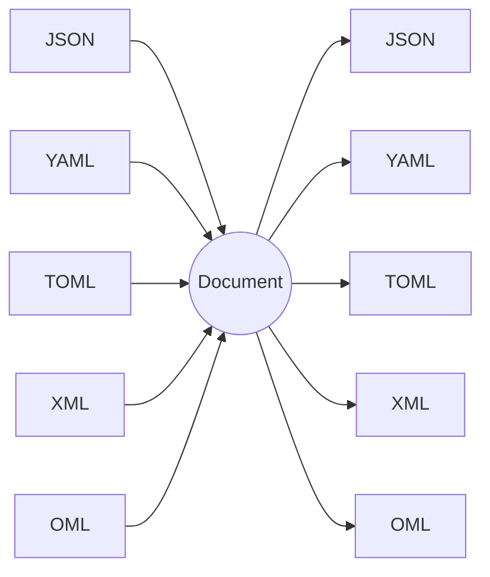

# Formats

Omnist reads JSON, YAML, TOML, XML, and its own native **OML** (Omnist
Markup Language) into **one** canonical Document, and writes that Document
back out to any of them. Because they share one model, converting is just
*read one, write another*:

```python
from omnist import Doc
Doc.from_json('{"name": "Ann", "tags": ["x", "y"]}').to_toml()
```

The same conversion from the command line:

```sh
omnist convert data.json --from json --to toml
```

See [the CLI docs](../cli.md) for the full command surface (`convert`,
`check`, `validate`, `infer`, and the `schema *` commands) — every
capability on this page is available from either the Python API or the
CLI.

## How a format becomes a Document

A Document is an ordered list of labeled edges (see the
[model spec](../design/model.md)). The mapping is the same idea for every
format:

- An object / mapping / table becomes a list of edges.
- A **key whose value is a list becomes a repeated label** — that's how an
  array appears. `{"tag": ["x", "y"]}` is the label `tag` twice, not a field
  pointing to a list.
- A scalar is a leaf value.

So the *same* data in different formats reads into the *same* Document — which
is what makes [a cross-format example](../example.md) validate against one
schema.

| Source | Document |
|---|---|
| JSON object `{"a":1,"b":2}` | `[(a,1),(b,2)]` |
| JSON keyed list `{"m":[A,B]}` | `[(m,A),(m,B)]` |
| YAML mapping / sequence | as JSON |
| TOML table / array-of-tables | as JSON |
| XML elements (incl. interleaved) | `[(tag,…),…]`, order preserved |
| OML edges `a: 1\nb: 2` (incl. interleaved) | `[(a,1),(b,2)]`, order preserved — OML *is* this model |

## Reading and writing

`read_*(text)` parse to a Document node; `Doc.from_*` wrap it; `Doc.to_*` /
`write_*` project back (same-label edges are grouped into a list).

```python
from omnist import read_yaml, Doc
d = Doc(read_yaml("name: Ann\ntags: [x, y]\n"))
d.to_json()
```

## Per-format pages

| Format | Notes |
|---|---|
| **[OML](oml.md)** | Omnist's own format; the only one with zero adjustments — every Document shape round-trips exactly |
| **[JSON](json.md)** | the baseline; no dependencies |
| **[YAML](yaml.md)** | the JSON-compatible core; needs `pyyaml` |
| **[TOML](toml.md)** | native dates, no `null`, top-level must be a table |
| **[XML](xml.md)** | single document element, repeated-element arrays, untyped text |

One model, many formats — every reader converges on the same Document, and
every writer diverges back out from it:



## Special features, mapped to OML

Beyond the basic shape mapping above, each format has its own quirky or
special-cased features. This table is about *those* — what each format does
that's distinctive, and concretely how OML / the Document model handles it
(or doesn't):

| Feature | Format | What happens |
|---|---|---|
| No native date/time type | JSON | `read_json` never produces `date`/`time`/`datetime` on its own; a date-looking string stays a plain `str` unless `schema=` upgrades it. `write_json` always stringifies a temporal leaf to ISO-8601 text (`temporal.stringified`). OML has the same gap — there's no native temporal literal in OML either, so a Document round-trips temporal values as typed Python objects in memory, but every textual format (including OML) carries them as strings without a schema. |
| No `NaN`/`Infinity` | JSON | `write_json` does not raise — it emits the literal tokens `NaN`/`Infinity`, which is not valid per the JSON spec (though Python's own `json.loads` is lenient enough to read it back). `check_json` reports this as `float.special`, an error-severity adjustment, so a caller checking the report learns about it without `write_json` itself failing. |
| Anchors/aliases (`&x` / `*x`) | YAML | `read_yaml` resolves aliases at parse time (via PyYAML's `safe_load`) — there is no shared-object identity preserved; `a: &x foo` / `b: *x` reads as the fully expanded `[('a', 'foo'), ('b', 'foo')]`, two independent edges with equal values. OML has no anchor/alias syntax at all — a Document is always the fully-expanded edge list, which is exactly what every YAML alias collapses to anyway. |
| Native `date`/`datetime` recognition (no schema) | YAML | PyYAML's `safe_load` resolves unquoted ISO-8601-looking scalars straight into `datetime.date`/`datetime.datetime` with zero schema involvement — e.g. `d: 2024-01-01` reads as `[('d', datetime.date(2024, 1, 1))]`. OML has no such resolver; a Document built from OML text needs `schema=` to get the same typed value, since OML's grammar has no native date literal. |
| Bare time-of-day as sexagesimal int | YAML | YAML's core schema has no standalone "time" type, so a bare `12:00:00` resolves to the *integer* `43200` (`12*3600 + 0*60 + 0`), not a `datetime.time` — confirmed: `read_yaml('a: 12:00:00')` returns `[('a', 43200)]`. This is PyYAML's own resolver behavior, not an omnist choice, and there is no schema-time workaround on the read side for a value that's already been resolved to an int by the time omnist sees it. OML sidesteps this because it has no bare-colon time literal to misparse in the first place. |
| Native `date`/`time`/`datetime` literals | TOML | `tomllib` parses TOML's date/time/datetime grammar directly into the matching Python types with no schema needed — confirmed for all three kinds (`d = 2024-01-01`, `t = 12:00:00`, `dt = 2024-01-01T12:00:00`). Writing round-trips the same way: TOML is the one format with no `temporal.stringified` adjustment in either direction. OML still has no native temporal literal, so going OML round-trip-equivalent would stringify where TOML wouldn't — this is the one case where TOML is *more* capable than OML on a specific scalar kind. |
| Array-of-tables (`[[x]]`) | TOML | The idiomatic way to write a repeated record; `[[items]] … [[items]] …` maps directly onto a repeated `items` label — confirmed: `read_toml('[[x]]\nname="a"\n[[x]]\nname="b"\n')` returns `[('x', [('name', 'a')]), ('x', [('name', 'b')])]`, the same repeated-edge shape OML uses natively for any repeated label, OML-block or not. |
| Repeated / interleaved elements | XML | The Document's defining feature and OML's native strength: an ordered edge list preserves interleaving (`<m/><x/><m/>` reads as `[(m,…),(x,…),(m,…)]`) that a dict-of-arrays can't represent. OML represents this the same way XML does — repeated labels in original order — because OML's edge list *is* the Document model, not a projection of it. |
| Attributes | XML | **Silently dropped, on both sides.** Confirmed directly: `read_xml('<a x="1"><b>hi</b></a>')` returns `[('a', [('b', 'hi')])]` — the `x="1"` attribute is gone, with no trace in the Document. `check_xml` on the same input reports `"no adjustments"` — the drop isn't even flagged as lossy. `write_xml` never produces an attribute on the way back out, either; there is no path from a Document edge to an XML attribute. This is a real, current limitation of the XML profile, not something OML or the Document model offers any equivalent for — OML has no attribute concept to lose, but XML's own attributes are simply outside what gets read at all. |
| Namespace prefixes | XML | Stripped on read: a prefixed tag like `<ns:b>` reads as the local name `b`, dropping the prefix and any namespace binding — confirmed via `_local()` in `omnist/formats.py`, and directly: `read_xml('<a xmlns:ns="http://x"><ns:b>hi</ns:b></a>')` returns `[('a', [('b', 'hi')])]` with no namespace information anywhere in the Document. As with attributes, `check_xml` reports no adjustment for this. A genuine, current limitation — OML has no namespace concept to map this onto. |
| Everything else | OML | The "always" row: every Document shape — any combination of nesting, repeated labels, and interleaving — round-trips through OML with zero adjustments, because OML's edge-list syntax *is* the Document model rather than a format that has to be mapped onto it. |

## One thing to know: single-rooted for XML

An XML document has exactly **one** top-level element, so its Document has one
top-level edge. To share a Document with the other three formats, wrap your
data under a single top-level key (e.g. `{"order": {…}}` ↔ `<order>…</order>`).
JSON/YAML/TOML happily carry multiple top-level keys; XML does not. See
[XML](xml.md).
