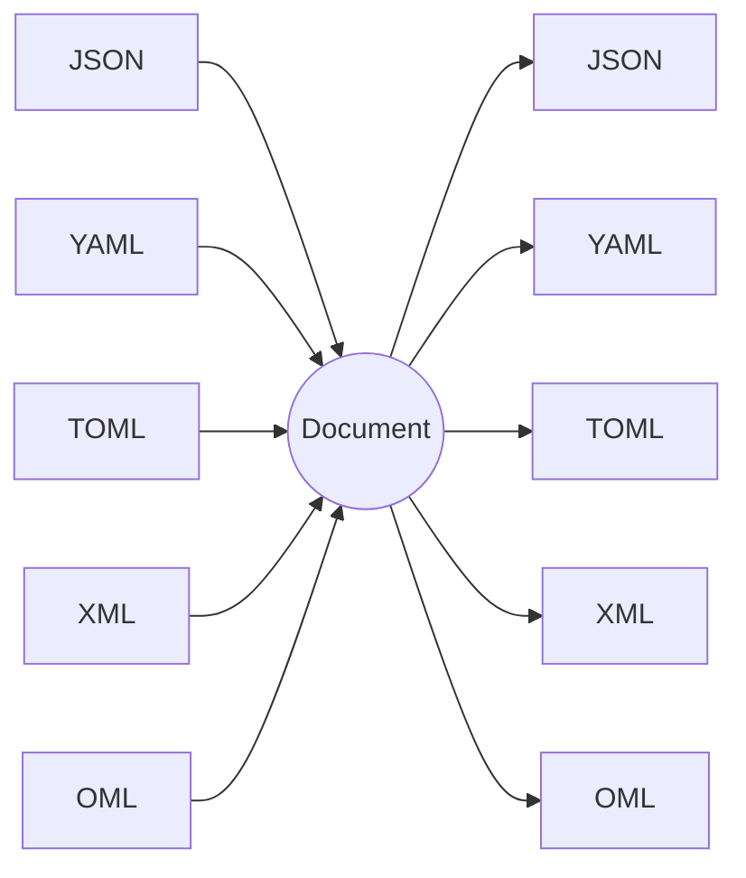

# Formats

Omnist reads JSON, YAML, TOML, XML, and its own native **OML** (Omnist
Markup Language) into **one** canonical Document, and writes that Document
back out to any of them. Because they share one model, converting is just
*read one, write another*:

```python
from omnist import Doc
Doc.from_json('{"name": "Ann", "tags": ["x", "y"]}').to_toml()
```

## How a format becomes a Document

A Document is an ordered list of labeled edges (see the
[model spec](../design/model.md)). The mapping is the same idea for every
format:

- An object / mapping / table becomes a list of edges.
- A **key whose value is a list becomes a repeated label** — that's how an
  array appears. `{"tag": ["x", "y"]}` is the label `tag` twice, not a field
  pointing to a list.
- A scalar is a leaf value.

So the *same* data in different formats reads into the *same* Document — which
is what makes [a cross-format example](../example.md) validate against one
schema.

| Source | Document |
|---|---|
| JSON object `{"a":1,"b":2}` | `[(a,1),(b,2)]` |
| JSON keyed list `{"m":[A,B]}` | `[(m,A),(m,B)]` |
| YAML mapping / sequence | as JSON |
| TOML table / array-of-tables | as JSON |
| XML elements (incl. interleaved) | `[(tag,…),…]`, order preserved |
| OML edges `a: 1\nb: 2` (incl. interleaved) | `[(a,1),(b,2)]`, order preserved — OML *is* this model |

## Reading and writing

`read_*(text)` parse to a Document node; `Doc.from_*` wrap it; `Doc.to_*` /
`write_*` project back (same-label edges are grouped into a list).

```python
from omnist import read_yaml, Doc
d = Doc(read_yaml("name: Ann\ntags: [x, y]\n"))
d.to_json()
```

## Per-format pages

| Format | Notes |
|---|---|
| **[OML](oml.md)** | Omnist's own format; the only one with zero adjustments — every Document shape round-trips exactly |
| **[JSON](json.md)** | the baseline; no dependencies |
| **[YAML](yaml.md)** | the JSON-compatible core; needs `pyyaml` |
| **[TOML](toml.md)** | native dates, no `null`, top-level must be a table |
| **[XML](xml.md)** | single document element, repeated-element arrays, untyped text |

One model, many formats — every reader converges on the same Document, and
every writer diverges back out from it:



## One thing to know: single-rooted for XML

An XML document has exactly **one** top-level element, so its Document has one
top-level edge. To share a Document with the other three formats, wrap your
data under a single top-level key (e.g. `{"order": {…}}` ↔ `<order>…</order>`).
JSON/YAML/TOML happily carry multiple top-level keys; XML does not. See
[XML](xml.md).
