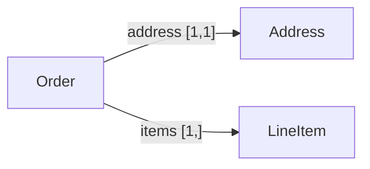
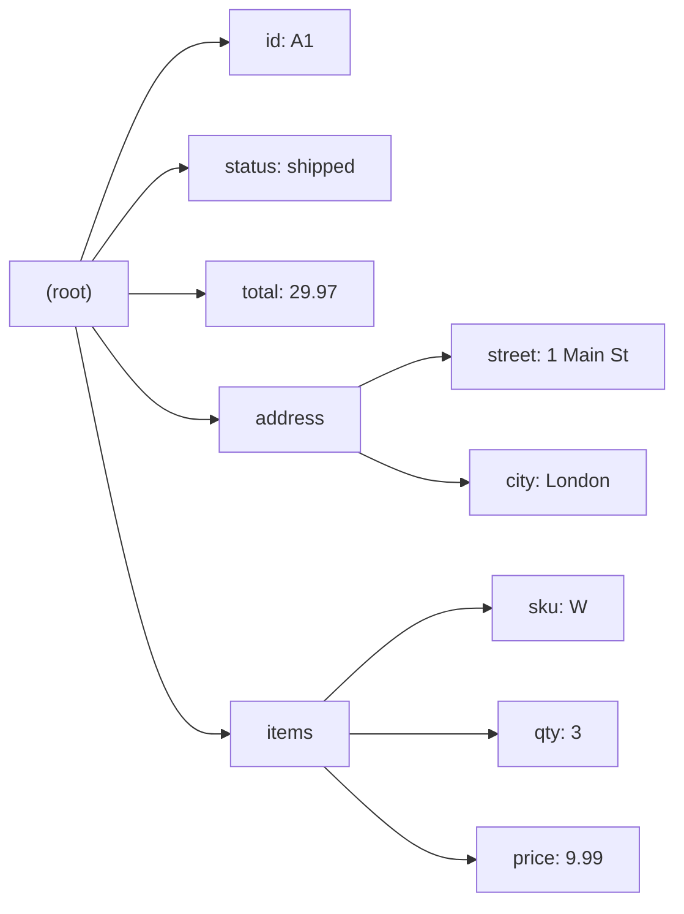

# Omnist — user guide

Omnist gives you **one canonical data model** for JSON, YAML, TOML, XML, and
its own native [**OML**](formats/oml.md), and a [**schema language**](schema.md)
to validate and compare shapes over it. (See [why Omnist](why-omnist.md) for
the differentiation case -- why this model, instead of JSON Schema/XSD/etc --
before diving into the how.) The model is defined formally in
[the model spec](design/model.md); this guide is the practical tour; the
[API reference](api.md) lists every name with signatures.

- [The two ideas](#the-two-ideas)
- [Documents](#documents)
- [OML — the native format](#oml--the-native-format)
- [Schemas — OSD](#schemas--osd)
- [Schemas — the Python builder](#schemas--the-python-builder)
- [Validation](#validation)
- [Operations](#operations)
- [Reading & writing other formats](#reading--writing-other-formats)
- [Inferring a schema](#inferring-a-schema)
- [A real-life example](#a-real-life-example)

## The two ideas

- A **Document** is a *tree*: a node is either a scalar value or an
  **ordered list of labeled edges**. "Many" is a label that repeats, not a
  field pointing to an array. See
  [the model spec, §4](design/model.md#4-document-model) for the formal
  definition and why it's shaped this way.
- A **Schema** is built from named **`record`** definitions (a closed set of
  named fields, each with a cardinality). A field's type is always exactly one
  of the seven fixed scalar kinds (optionally nullable, e.g. `string?`) or a
  `Ref` to a named record — never a composition of the two. `Ref`s are how
  reuse and recursion work. See
  [the model spec, §5](design/model.md#5-schema-model) for the formal
  definition.

```python
from omnist import parse_schema, doc

s = parse_schema('''
    record User { "name": string, "age" [0,1]: integer }
    root User
''')
s.validate(doc({"name": "Ann"})).ok          # True
```

## Documents

`doc(value)` builds a Document from plain Python. A dict becomes an edge list; a
key whose value is a list expands into one edge per item (a repeated label).

```python
from omnist import doc

d = doc({"name": "Ann", "tag": ["x", "y"]})
d.labels()                 # ['name', 'tag']
d.count("tag")             # 2  -- 'tag' is a repeated label (an array)
d.get_one("name").value    # 'Ann'
[t.value for t in d.get("tag")]   # ['x', 'y']
d.to_data()                # [('name', 'Ann'), ('tag', 'x'), ('tag', 'y')]
d.to_grouped()             # {'name': 'Ann', 'tag': ['x', 'y']}   (JSON-shaped)
```

Edit through the guarded API (a repeated `add` is how an array grows):

```python
d.add("tag", "z")          # append an edge
d.set("name", "Bob")       # replace the single 'name'
d.remove("tag")            # drop every 'tag' edge
d.child("name")            # a cursor to the single child
```

## OML — the native format

**OML** (Omnist Markup Language) is Omnist's own format — the only one that
round-trips every Document shape (all seven scalars, `null`, repeated and
interleaved labels, arbitrary nesting, multiple top-level edges) with zero
adjustments. See [the OML format page](formats/oml.md) for the full pitch,
grammar, escaping rules, and edge cases.

```python
from omnist import Doc

d = Doc.from_oml('''
name: "Ann"
tag: "x"
tag: "y"
joined: 2024-01-01
''')
d.to_grouped()             # {'name': 'Ann', 'tag': ['x', 'y'], 'joined': datetime.date(2024, 1, 1)}
d.to_oml()                 # back to OML text, byte-for-byte stable
```

Reach for OML whenever you're not constrained to a specific interchange
format: for example, as a config or fixture format inside your own project,
or as the artifact you snapshot/diff in tests.

## Schemas — OSD

A schema is written as **OSD** (Omnist Schema Definition): `record`
definitions plus a `root`. **Cardinality `[min,max]`** is the only
multiplicity knob (required / optional / array), and a field's type is
always exactly one fixed scalar or one `Ref` — never a composition. See
[the Schema model & OSD](schema.md#shape) for the full shape, cardinality
rules, and quoting conventions (same depth of treatment as
[the OML page](formats/oml.md) gives the native format).

```
record Address { "street": string, "city": string }

record User {
    "name":          string,        # required (default cardinality [1,1])
    "nickname" [0,1]: string,        # optional
    "emails" [1,]:    string,        # one or more (an array)
    "address":       Address,        # Ref to a named record
    "note":          string?,       # nullable scalar
}
root User
```

Round-tripping back to text:

```python
from omnist import parse_schema, to_osd

s = parse_schema('record Car { "license": string }\nroot Car')
to_osd(s)                  # prints the schema back as OSD
```

## Schemas — the Python builder

The same schema can be built from Python instead of parsed from OSD text —
see [the Schema model & OSD: the Python builder](schema.md#the-python-builder)
for the full builder reference (`record`, `field`, `ref`, `nullable`, `t`,
`schema`).

```python
from omnist import schema, record, field, ref, nullable, t

address = record(field("street", t.string),
                 field("city",   t.string))
user = record(
    field("name",    t.string),
    field("emails",  t.string, min=1, max=None),   # [1,]
    field("address", ref("Address")),
    field("note",    nullable(t.string)),          # nullable scalar
)
s = schema(ref("User"), User=user, Address=address)
```

## Validation

`schema.validate(doc)` returns a `ValidationResult` with `.ok` and `.errors`
(each an `Error(path, message)`); validation **ignores edge order**. See
[the Schema model & OSD: Validation](schema.md#validation) for more on the
result shape.

```python
r = parse_schema('record R { "items" [1,]: integer }\nroot R').validate(
        doc({"items": []}))
r.ok                       # False
print(r)
# invalid:
#   at $: field 'items' occurs 0 time(s), expected at least 1
```

## Operations

Comparison operations are **methods on `Schema`** — `compatible_with` (is
every document one schema accepts also accepted by another, the
backward-compatibility check), `equivalent`, and `normalize`. See
[the Schema model & OSD: Operations](schema.md#operations-compare-and-infer)
for the full set.

```python
v1 = parse_schema('record R { "host": string }\nroot R')
v2 = parse_schema('record R { "host": string, "port" [0,1]: integer }\nroot R')

v1.compatible_with(v2)     # True  -- every v1 doc is valid under v2
v2.compatible_with(v1)     # False
v1.equivalent(v2)          # False
s.normalize()              # merge structurally identical named definitions
```

## Reading & writing other formats

`read_*` parse a format into a Document node; `Doc.from_*` wrap it; `Doc.to_*`
write back. JSON, YAML, TOML, and XML all read into the *same* Document that
OML does — converting between any of the five is just *read one, write
another*.

```python
from omnist import Doc

Doc.from_json('{"name": "Ann", "tags": ["x", "y"]}').to_toml()
Doc.from_yaml("name: Ann\n").to_json()
```

XML is single-rooted — its document element is the one top-level edge — and
preserves interleaving on read; writing requires a single top-level edge.

Writing is lenient by default: a value a format can't hold losslessly (TOML has
no `null`; JSON/XML have no date type) is adjusted, and the adjustment is
recorded rather than lost silently.

```python
from omnist import doc, WriteReport, WriteError

d = doc({"a": 1, "b": None})
d.to_toml()                          # 'a = 1\n' -- 'b' dropped, silently

rep = WriteReport()
d.to_toml(report=rep)                # inspect what changed
[(a.code, a.severity) for a in rep]  # [('null.omitted', 'warning')]

d.to_toml(strict=True)               # raises WriteError instead of adjusting
```

`check_json` / `check_yaml` / `check_toml` / `check_xml` simulate a write and
return the report without producing output — and so do the matching `Doc`
methods, `d.check_toml()` etc., so you don't need to drop down to `to_data()`
just to ask "would this be lossy":

```python
d.check_toml()                       # same report d.to_toml(report=...) would fill
```

See [the API reference](api.md#adjustment-reports-lossy-writes) for the full
list of adjustment codes.

### Schema-directed deserialization

Without `schema=`, a reader's leaves are exactly whatever the format's own
native parser produces (e.g. JSON gives back a plain `str` for a date). Pass
`schema=` to upgrade leaves to match what the schema declares — an ISO-8601
string to a real `date`/`time`/`datetime`, an int literal to the exact
numeric type — whenever the conversion is value-exact.

See [Schema-directed deserialization](deserialization.md) for the full
explanation, a worked before/after example, and the conversion rules.

### Custom formats

Formats are plugins — register your own and it's usable everywhere `Doc` reads
and writes a format by name:

```python
from omnist import Format, register_format, Doc

register_format(Format(
    name="lines",
    read=lambda text: [("n", int(x)) for x in text.split()],
    write=lambda node, **opts: " ".join(str(v) for _, v in node),
))
Doc.from_format("lines", "1 2 3").to_format("lines")    # '1 2 3'
```

## Inferring a schema

`infer(samples)` drafts a schema from example Documents:

```python
from omnist import infer, doc

s = infer([doc({"id": 1, "tags": ["a"]}), doc({"id": 2, "tags": ["b", "c"]})])
print(s.to_osd())
# record Root {
#     "id": integer,
#     "tags" [0,]: string,
# }
# root Root
```

## A real-life example

An order schema combining named records, a required array, an optional
field, and recursion-free reuse — built once, validated across formats.

```python
from omnist import parse_schema, Doc

ORDER = '''
record Address  { "street": string, "city": string }
record LineItem { "sku": string, "qty": integer, "price": number }
record Order {
    "id":       string,
    "status":   string,
    "total":    number,
    "address":  Address,
    "items" [1,]: LineItem,        # at least one line item
    "coupon" [0,1]: string,         # optional
}
root Order
'''
s = parse_schema(ORDER)
```

The records form a graph, linked by `Ref` edges with the field's
cardinality attached:



```python
good = Doc.from_oml('''
id: "A1"
status: "shipped"
total: 29.97
address: { street: "1 Main St"; city: "London" }
items: { sku: "W"; qty: 3; price: 9.99 }
''')
s.validate(good).ok        # True
```

The resulting Document, as a tree of labeled edges:



```python
bad = Doc.from_oml('''
id: "A2"
status: "shipped"
total: "ten"
address: { street: "x"; city: "y" }
''')
print(s.validate(bad))
# invalid:
#   at $.total: expected number, got string ('ten')
#   at $: field 'items' occurs 0 time(s), expected at least 1
```

This Document didn't have to come from OML — JSON, YAML, TOML, and XML all
read into the same shape; see [the real-life example](example.md) for the
full cross-format walkthrough and [Formats](formats/overview.md) for each
one's caveats.

For a fuller version — the same order validated against documents in **all four
formats**, plus a compatibility check — see [a real-life example](example.md).
[`examples/canonical_model.py`](https://github.com/omnist-dev/omnist/blob/master/examples/canonical_model.py) is a runnable
end-to-end version; [the model spec](design/model.md) has the formal
definitions; and [Formats](formats/overview.md) covers each format's mapping
and caveats.
