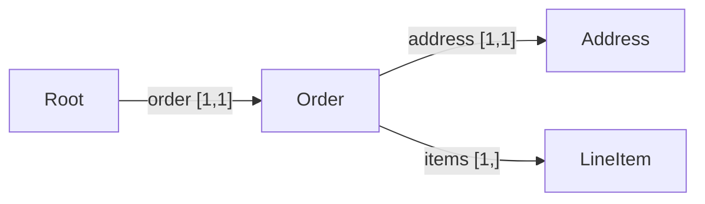
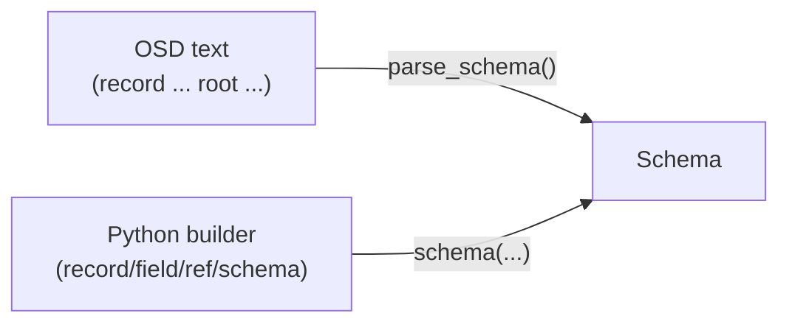

# The Schema model & OSD

A **Schema** is Omnist's other central feature, alongside
[OML](formats/oml.md). It's written as **OSD** (Omnist Schema Definition) —
a small, closed text language for describing the shape a Document must
have: `record` definitions — a closed set of named fields, each with a
cardinality — plus a `root` saying which one a document validates against.
There's no JSON Schema-style open-ended composition: a field's type is
always **exactly one** fixed scalar or one reference to another record,
never a union, enum, or literal value.

```python
from omnist import parse_schema, doc

s = parse_schema('''
    record Member { "name": string, "role": string }
    record Team   { "name": string, "members" [1,]: Member }
    root Team
''')
s.validate(doc({"name": "Platform",
                "members": [{"name": "Ann", "role": "dev"}]})).ok    # True
```

## Shape

```
record Address { "street": string, "city": string }

record User {
    "name":          string,        # required (default cardinality [1,1])
    "nickname" [0,1]: string,        # optional
    "emails" [1,]:    string,        # one or more (an array)
    "address":       Address,        # Ref to a named record
    "note":          string?,       # nullable scalar
}
root User
```

- **Field labels are always quoted** (they're data strings, and may contain
  spaces: `"home address"`). An unquoted identifier in type position is a
  *schema name* — a scalar keyword (`string`, `integer`, …) or a `Ref` to a
  record.
- **Cardinality `[min,max]`** is the only multiplicity knob: `[1,1]`
  required (the default — omit the brackets), `[0,1]` optional, `[0,]`
  zero-or-more, `[1,]` one-or-more, `[2,5]` bounded. **There is no separate
  array type** — an array is just a field with `max > 1`.
- A field's type is **always exactly one** of the seven fixed scalars
  (`string`, `integer`, `number`, `boolean`, `date`, `time`, `datetime`),
  optionally suffixed `?` for nullable (`string?`), or a `Ref` (an unquoted
  name) to a named record. `?` is independent of cardinality — a *required*
  field can still be nullable (it must appear, but its value may be `null`).
  `?` never applies to a `Ref`; a record that may be absent is `[0,1]`, never
  `Ref?`.
- **Records are closed** — an unexpected label is a validation error, not
  silently ignored.

The records of a schema form a graph, linked by `Ref` edges with the field's
cardinality attached. Using the order schema from
[the real-life example](example.md#the-schema) (`Order` has one `address`
and one or more `items`):



All of this is defined formally, with proofs, in
[the model spec](design/model.md).

## The Python builder

The same schema, built from Python instead of parsed from text. Scalar
instances live under the `t` namespace (and also as top-level names
`STRING`, `INTEGER`, …) and are passed as-is as a field's type:

```python
from omnist import schema, record, field, ref, nullable, t

address = record(field("street", t.string), field("city", t.string))
user = record(
    field("name",     t.string),
    field("nickname", t.string, min=0, max=1),
    field("emails",   t.string, min=1, max=None),     # [1,]
    field("address",  ref("Address")),
    field("note",     nullable(t.string)),            # nullable scalar
)
s2 = schema(ref("User"), User=user, Address=address)

s.equivalent(s2)      # True -- same schema, built two different ways
```

Two paths, one result — OSD text and the Python builder both produce an
ordinary `Schema` object; nothing downstream (`validate`, `compatible_with`,
`to_osd`, …) can tell which path built the one it's holding:




`t.string` / `t.integer` / `t.number` / `t.boolean` / `t.date` / `t.time` /
`t.datetime` are ready-to-use `Scalar` instances; `nullable(scalar)` returns
a nullable copy; `field(label, type, min=1, max=1)`; `record(*fields)`;
`schema(root_ref, **named_definitions)`. `to_osd(schema)` serializes a
`Schema` built either way back to OSD text:

```python
from omnist import to_osd

to_osd(parse_schema('record Car { "license": string }\nroot Car'))
# 'record Car {\n    "license": string,\n}\nroot Car\n'
```

`to_osd(schema, indent=None)` (and the equivalent `schema.to_osd(indent=None)`)
renders the same schema on a single line instead, for cases where
pretty-printing isn't useful (e.g. embedding in a log line or a one-line
config value):

```python
to_osd(parse_schema('record Car { "license": string }\nroot Car'), indent=None)
# 'record Car { "license": string } root Car\n'
```

Both forms round-trip through `parse_schema` to an equivalent `Schema`.

## Validation

`schema.validate(doc)` returns a `ValidationResult` with `.ok` and `.errors`
(each an `Error(path, message, code)`, at the exact failing path, with a
stable machine-readable code — see [the API reference](api.md#class-error)
for the code table); validation
**ignores edge order** — see [OML's note on order vs.
validation](formats/oml.md#shape) for why that's true even though OML
preserves order as data:

```python
bad = doc({"emails": [], "address": {"street": "x", "city": "y"}})
print(s.validate(bad))
# invalid:
#   at $: field 'name' occurs 0 time(s), expected exactly 1
#   at $: field 'emails' occurs 0 time(s), expected at least 1
#   at $: field 'note' occurs 0 time(s), expected exactly 1
```

## Operations: compare and infer

Schema comparisons are **methods on `Schema`**, not free functions:

```python
v1 = parse_schema('record R { "host": string }\nroot R')
v2 = parse_schema('record R { "host": string, "port" [0,1]: integer }\nroot R')

v1.compatible_with(v2)     # True  -- every v1 document is still valid under v2
v2.compatible_with(v1)     # False -- a v2 document with a port isn't valid under v1
```

`equivalent(other)` is the symmetric version — True when both schemas accept
exactly the same set of documents.  Two schemas built from different OSD text
can be equivalent if they describe the same structure:

```python
s1 = parse_schema('record R { "x": integer }\nroot R')
s2 = parse_schema('record Alias { "x": integer }\nroot Alias')

s1.equivalent(s2)      # True  -- same structure, different record name
s1.compatible_with(s2) # True  (both directions are True when equivalent)
s2.compatible_with(s1) # True
```

`normalize()` returns the canonical **minimal** schema equivalent to this
one — the fewest possible env records, unique up to record naming. It works
by partition refinement, the same family of algorithm as DFA minimization:
records start out grouped by local shape, then groups get split apart
wherever their same-labeled ref fields point at still-distinguishable
targets, repeating until nothing more can be told apart. This merges more
than plain structural identity would — ref-chained duplicates collapse in
one call (no need to call `normalize()` twice), and even mutually-recursive
"twin" records merge when they're truly equivalent. Unreachable records and
never-emittable fields are pruned first, since a record's shape (and so
what counts as "identical") is only well-defined once dead structure is
gone. Useful after `infer` or programmatic construction, either of which
may produce duplicate record definitions:

```python
s = parse_schema("""
record A { "x": integer }
record B { "x": integer }
root A
""")

n = s.normalize()
print(n.to_osd())
# record A {
#     "x": integer,
# }
# root A
```

`B` is gone — it was merged into `A` because they are structurally
identical (and `A` is unreachable-record-free and already minimal, so this
one-record example doesn't show the ref-chained/recursive merging above;
see `tests/test_canonical.py`'s `TestNormalizePartitionRefinement` for
those cases).

`infer(samples)` drafts a `Schema` from example Documents instead of writing
OSD by hand:

```python
from omnist import infer

print(infer([doc({"host": "b", "port": 80}), doc({"host": "a"})]).to_osd())
# record Root {
#     "host": string,
#     "port" [0,1]: integer,
# }
# root Root
```

See [the guide](guide.md#operations) for additional detail on all four
operations and [the guide's inference section](guide.md#inferring-a-schema)
for `infer`'s exact cardinality and nullability rules.

### Subschema extraction

`extract(*labels)` returns the minimal subschema that only recognizes
documents built from `labels` — the paper's Algorithm 5 (ExtractSubschema),
whose headline application is trimming a large shared schema (the paper
uses xCBL) down to just what one document type actually needs, reported
there as a 6-32% size reduction. Fields whose label isn't in the kept set
are deleted:

```python
quote_order = parse_schema('''
record Root  { "quote" [0,1]: Quote, "order" [0,1]: Order }
record Quote { "line" [1,]: Line }
record Order { "line" [1,]: OrderLine }
record Line  { "desc": string, "price": number }
record OrderLine { "product" [1,]: Product, "qty": integer }
record Product   { "desc": string, "price": number }
root Root
''')

ex = quote_order.extract("quote", "line", "desc", "price")
print(sorted(ex.env))                        # ['Line', 'Quote', 'Root']
ex.compatible_with(quote_order)              # True
```

`"order"` isn't in the kept label set, so the `order` field is dropped from
`Root`; that makes `Order`/`OrderLine`/`Product` unreachable, and `prune()`
(run automatically as the last step) removes them. The result is always
`compatible_with` the original — every document the extract accepts, the
original accepts too, since extraction can only narrow what's accepted,
never widen it.

**Deleting a *mandatory* field is an error, not silently allowed.** If the
dropped field had `min >= 1`, the record that had it can no longer be
built at all — the paper calls this "state removed." That invalidation
propagates: a record with a mandatory field typed to an invalidated record
is itself invalidated, and so on. If this reaches the root, there is no
valid subschema for that label set, and `extract` raises `SchemaError`
naming the first offending label and record, rather than quietly making
the field optional:

```python
s = parse_schema('record R { "must": integer, "opt" [0,1]: string }\nroot R')
s.extract("opt")
# SchemaError: no valid subschema: removing label 'must' deletes a
# mandatory field of record 'R'
```

This is a deliberate design decision: silently relaxing cardinality would
mean the result no longer matches what the caller's `keep` set actually
describes, and it would hide what's far more often a mistake in that
`keep` set than an intentional relaxation. Extracting with every label the
schema uses is equivalent to `normalize()` (nothing is dropped, so only
the minimization step has any effect).

### Empty schemas

A schema can describe **no finite document at all** — the empty language —
when satisfying it would require an infinite structure. This happens with a
*mandatory* ref cycle: every record in the cycle requires the next one, so
there is no base case to stop at.

```python
empty = parse_schema('record A { "x": B }\nrecord B { "y": A }\nroot A')
other = parse_schema('record C { "z": integer }\nroot C')

empty.is_empty()               # True  -- no finite document satisfies A
empty.compatible_with(other)   # True  -- vacuous: it emits no documents at all
other.compatible_with(empty)   # False -- other's documents aren't accepted by empty

empty2 = parse_schema('record P { "q": P }\nroot P')
empty.equivalent(empty2)       # True  -- both accept exactly nothing
```

This is intentional, not a special case bolted on: `compatible_with` means
"every document `a` accepts is also accepted by `b`," and when `a` accepts
no documents, that's vacuously true for any `b`. Two schemas that both
accept nothing are trivially equivalent, regardless of how different their
record definitions look.

`is_empty()` tells you whether the schema is one of these — root record
unsatisfiable, no finite document exists. `prune()` returns an equivalent
schema with everything that can never actually appear removed: records
unreachable from root, fields that can never be emitted (`[0,0]`
cardinality), and optional fields whose type is itself unsatisfiable:

```python
s = parse_schema('record R { "x" [0,1]: Dead }\nrecord Dead { "d": Dead }\n'
                 'root R')
s.is_empty()                   # False -- R itself doesn't require Dead
p = s.prune()
p.to_osd()
# record R {
# }
# root R
```

`x` is gone: it's optional, and its type (`Dead`) can never be satisfied, so
a document that has `x` present can never actually exist. `prune(s)` is
always `equivalent` to `s`. If the *root* itself is unsatisfiable, `prune()`
leaves the root record's fields untouched — pruning them would silently
produce a different, satisfiable schema, breaking the equivalence
guarantee.

## See also

- [User guide](guide.md) — the practical tour, including the Python builder,
  validation, operations, and inference in full.
- [OML](formats/oml.md) — Omnist's other central feature: the native,
  lossless format for the Documents a schema validates.
- [A real-life example](example.md) — one order schema validated against an
  OML document, plus a backward-compatibility check.
- [Model spec](design/model.md) — the formal Schema model, self-contained
  and plain.
- For the full formal grammar, see
  [the OSD grammar](design/schema-osd-grammar.md).
