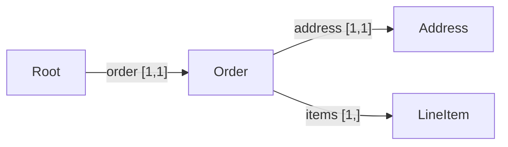
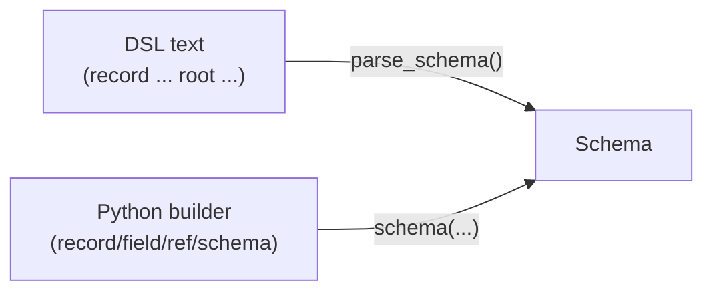

# The Schema model & the DSL

A **Schema** is Omnist's other central feature, alongside
[OML](formats/oml.md): a small, closed language for describing the shape a
Document must have. It's `record` definitions — a closed set of named
fields, each with a cardinality — plus a `root` saying which one a document
validates against. There's no JSON Schema-style open-ended composition: a
field's type is always **exactly one** fixed scalar or one reference to
another record, never a union, enum, or literal value.

```python
from omnist import parse_schema, doc

s = parse_schema('''
    record Member { "name": string, "role": string }
    record Team   { "name": string, "members" [1,]: Member }
    root Team
''')
s.validate(doc({"name": "Platform",
                "members": [{"name": "Ann", "role": "dev"}]})).ok    # True
```

## Shape

```
record Address { "street": string, "city": string }

record User {
    "name":          string,        # required (default cardinality [1,1])
    "nickname" [0,1]: string,        # optional
    "emails" [1,]:    string,        # one or more (an array)
    "address":       Address,        # Ref to a named record
    "note":          string?,       # nullable scalar
}
root User
```

- **Field labels are always quoted** (they're data strings, and may contain
  spaces: `"home address"`). An unquoted identifier in type position is a
  *schema name* — a scalar keyword (`string`, `integer`, …) or a `Ref` to a
  record.
- **Cardinality `[min,max]`** is the only multiplicity knob: `[1,1]`
  required (the default — omit the brackets), `[0,1]` optional, `[0,]`
  zero-or-more, `[1,]` one-or-more, `[2,5]` bounded. **There is no separate
  array type** — an array is just a field with `max > 1`.
- A field's type is **always exactly one** of the seven fixed scalars
  (`string`, `integer`, `number`, `boolean`, `date`, `time`, `datetime`),
  optionally suffixed `?` for nullable (`string?`), or a `Ref` (an unquoted
  name) to a named record. `?` is independent of cardinality — a *required*
  field can still be nullable (it must appear, but its value may be `null`).
  `?` never applies to a `Ref`; a record that may be absent is `[0,1]`, never
  `Ref?`.
- **Records are closed** — an unexpected label is a validation error, not
  silently ignored.

The records of a schema form a graph, linked by `Ref` edges with the field's
cardinality attached. Using the order schema from
[the real-life example](example.md#the-schema) (`Order` has one `address`
and one or more `items`):



All of this is defined formally, with proofs, in
[the model spec](design/model.md).

## The Python builder

The same schema, built from Python instead of parsed from text. Scalar
instances live under the `t` namespace (and also as top-level names
`STRING`, `INTEGER`, …) and are passed as-is as a field's type:

```python
from omnist import schema, record, field, ref, nullable, t

address = record(field("street", t.string), field("city", t.string))
user = record(
    field("name",     t.string),
    field("nickname", t.string, min=0, max=1),
    field("emails",   t.string, min=1, max=None),     # [1,]
    field("address",  ref("Address")),
    field("note",     nullable(t.string)),            # nullable scalar
)
s2 = schema(ref("User"), User=user, Address=address)

s.equivalent(s2)      # True -- same schema, built two different ways
```

Two paths, one result — DSL text and the Python builder both produce an
ordinary `Schema` object; nothing downstream (`validate`, `compatible_with`,
`to_dsl`, …) can tell which path built the one it's holding:




`t.string` / `t.integer` / `t.number` / `t.boolean` / `t.date` / `t.time` /
`t.datetime` are ready-to-use `Scalar` instances; `nullable(scalar)` returns
a nullable copy; `field(label, type, min=1, max=1)`; `record(*fields)`;
`schema(root_ref, **named_definitions)`. `to_dsl(schema)` serializes a
`Schema` built either way back to DSL text:

```python
from omnist import to_dsl

to_dsl(parse_schema('record Car { "license": string }\nroot Car'))
# 'record Car {\n    "license": string,\n}\nroot Car\n'
```

## Validation

`schema.validate(doc)` returns a `ValidationResult` with `.ok` and `.errors`
(each an `Error(path, message)`, at the exact failing path); validation
**ignores edge order** — see [OML's note on order vs.
validation](formats/oml.md#shape) for why that's true even though OML
preserves order as data:

```python
bad = doc({"emails": [], "address": {"street": "x", "city": "y"}})
print(s.validate(bad))
# invalid:
#   at $: field 'name' occurs 0 time(s), expected exactly 1
#   at $: field 'emails' occurs 0 time(s), expected at least 1
#   at $: field 'note' occurs 0 time(s), expected exactly 1
```

## Operations: compare and infer

Schema comparisons are **methods on `Schema`**, not free functions:

```python
v1 = parse_schema('record R { "host": string }\nroot R')
v2 = parse_schema('record R { "host": string, "port" [0,1]: integer }\nroot R')

v1.compatible_with(v2)     # True  -- every v1 document is still valid under v2
v2.compatible_with(v1)     # False -- a v2 document with a port isn't valid under v1
```

`infer(samples)` drafts a `Schema` from example Documents instead of writing
the DSL by hand:

```python
from omnist import infer

print(infer([doc({"host": "b", "port": 80}), doc({"host": "a"})]).to_dsl())
# record Root {
#     "host": string,
#     "port" [0,1]: integer,
# }
# root Root
```

See [the guide](guide.md#operations) for the full set of operations
(`compatible_with`, `equivalent`, `normalize`) and
[the guide's inference section](guide.md#inferring-a-schema) for `infer`'s
exact cardinality and nullability rules.

## See also

- [User guide](guide.md) — the practical tour, including the Python builder,
  validation, operations, and inference in full.
- [OML](formats/oml.md) — Omnist's other central feature: the native,
  lossless format for the Documents a schema validates.
- [A real-life example](example.md) — one order schema validated against an
  OML document, plus a backward-compatibility check.
- [Model spec](design/model.md) — the formal Schema model, self-contained
  and plain.
- For the full formal grammar, see
  [the Schema DSL grammar](design/schema-dsl-grammar.md).
